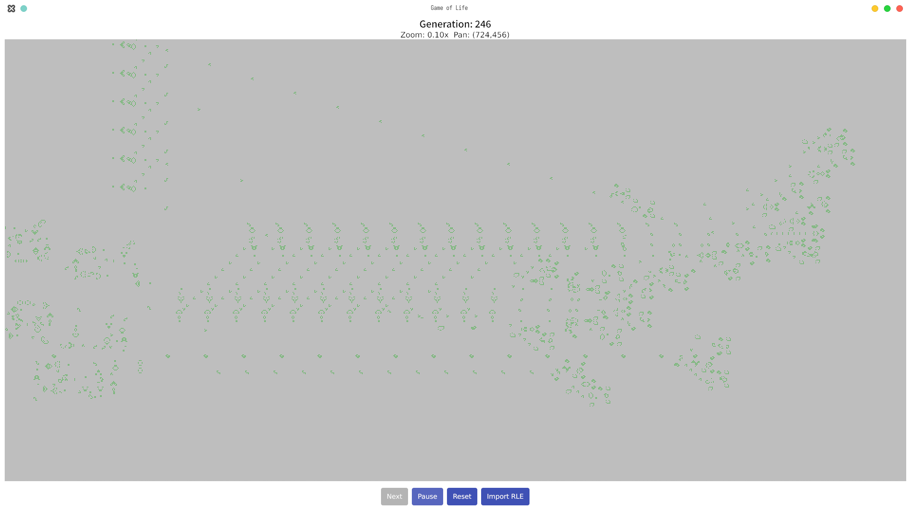

## Conway's Game of Life in Go

This project is a high-performance implementation of Conway's Game of Life in Go, featuring:

- A sparse map-based "infinite" grid that can grow dynamically during runtime
- A minimal GUI
  - Zoom with -/+
  - Pan with arrow keys
  - Edit cells with a click
- RLE support 
- Test suite for common patterns (still lifes, oscillators, spaceships)



### Usage

Run the program:

```sh
go run main.go
```

### Testing

Run all tests:

```sh
go test
```

### Features

- An "infinite" grid that can grow dynamically during runtime
- A minimal GUI
  - Zoom with -/+
  - Pan with arrow keys
  - Edit cells with a click
- RLE support
- Comprehensive test suite for classic Game of Life patterns

### License

MIT License
