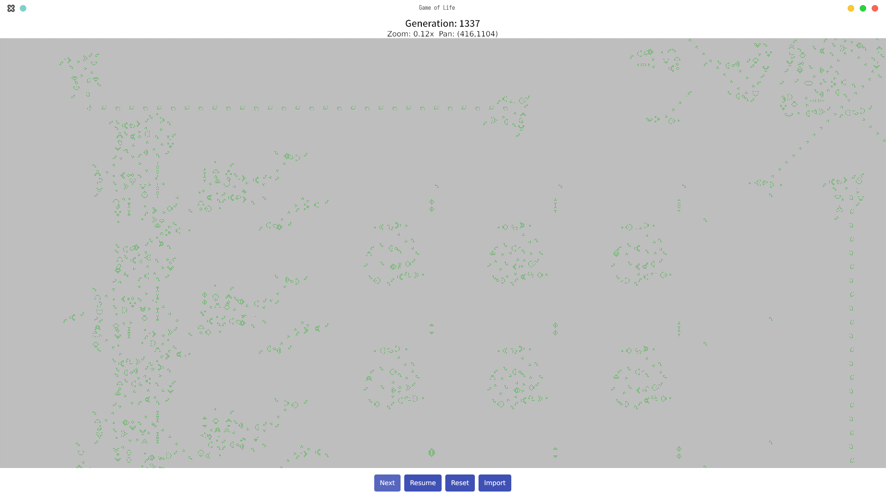

## Conway's Game of Life in Go

This project is a high-performance implementation of Conway's Game of Life in Go, featuring:

- A sparse map-based "infinite" grid that can grow dynamically during runtime
- NVIDIA GPU support, falls back to CPU if unavailable!
- A minimal GUI
  - Zoom with -/+ or the mouse wheel
  - Pan with arrow keys or secondary button drag
  - Edit cells with a primary button click
- RLE support 
- Test suite for common patterns (still lifes, oscillators, spaceships)

## Automatic GPU detection
`gol` tries to detect an NVIDIA GPU at runtime.

- GPU mode will be enabled if these 3 conditions are met:
  - CUDA-capable GPU present on the system
  - NVIDIA driver installed
  - CUDA runtime installed
- Otherwise, CPU mode is used.

## Build
In order to build this project from source, you *must* install the CUDA Toolkit and build the `.so`. 
Follow the instructions in `internal/gpu`.

You could also download one of the `.so`s from a Release and point to that, instead of `make`ing it yourself.

Otherwise, grab a release and run `start.sh`!

### License

MIT License
